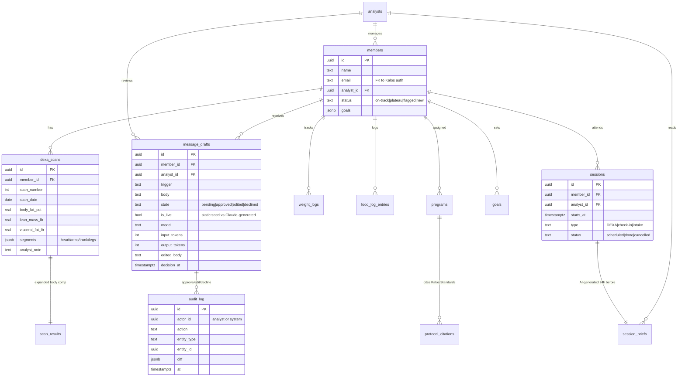

# Telos · Full Build Plan

A realistic engineering roadmap to take the front-end prototype in this repo and ship Telos as a production AI continuity layer for Kalos Health.

This is the build I'd propose on day-one of the role, not a sales doc. Timelines below assume **one engineer starting at Kalos** (me). With a second engineer added at Phase 3, the total compresses meaningfully — noted at the bottom.

> **What exists today:** front-end prototype in `src/`. React 19 + Vite + TypeScript on Vercel. Member/coaching data is synthetic, and there is no production backend, auth, or Kalos data integration. The deployed demo does include one Vercel serverless endpoint (`api/draft-message`) backed by a small Hono + Drizzle + Neon Postgres surface for **live Claude-generated drafts** in the AI Inbox — the rest of the page reads from static seeds. Roughly 60% of the eventual UI surface.
>
> **What this plan covers:** the other 40% of the surface, plus everything underneath it — real auth, the production Kalos-data integration, the full backend, and the Phase 2+ work that turns the live-draft demo from "one endpoint" into "the analyst's actual queue."

---

## Stack decisions (committed)

| Layer | Choice | Why |
|---|---|---|
| Frontend | **React 19 + TypeScript + Vite** | Already what Kalos hires for; already the prototype |
| Mobile | **React Native (Expo)** Phase 6 | Reuse 70%+ of components; HealthKit access via Expo modules |
| Backend | **Node.js + Hono** on Postgres | Matches Kalos's stack (Node + Postgres + SQL Server). Hono over Express for type-safe routes and edge-deployable |
| ORM | **Drizzle** | Type-safe, migration-first, plays well with both Postgres and SQL Server |
| Auth | **Clerk** (initially) → **self-hosted later** | Day-1 SSO + magic links + MFA without building it. Migrate to self-hosted at Phase 7 for full data residency |
| Hosting | **Vercel** (FE) + **Railway / Fly** (BE) | Already deploying FE to Vercel. BE on Railway for Phase 1-4, evaluate AWS at Phase 7 for HIPAA BAA |
| AI provider | **Anthropic Claude (API)** + **Cursor / Claude Code** for dev | Their job posting explicitly names Claude Code + Cursor. Claude 4.x for prompted briefs in Phase 2, fine-tuned model in Phase 5 |
| Observability | **OpenTelemetry → Honeycomb** | Cheap, traceable, plays well with both Vercel + Railway |
| CI | **GitHub Actions** | Already on GitHub |
| Compliance posture | **HIPAA-ready from day 1** | Even pre-BAA, the architecture should make audit trivial later |

---

## Phase 0 · Foundation (weeks 1–2)

**Goal:** infrastructure ready, repo clean, single command spins up local dev.

- Repo restructure to monorepo (`apps/web`, `apps/api`, `packages/db`, `packages/shared-types`) using pnpm workspaces
- Postgres on Neon (dev) + Railway (prod). One DB per environment.
- Drizzle schema + migrations skeleton
- Clerk integrated for auth (member role, analyst role, admin role)
- GitHub Actions: lint + typecheck + build on PR, deploy on merge to main
- Vercel preview deployments per PR
- `.env.example` with all keys, secrets in Vercel + Railway dashboards
- HIPAA-aware logging from day 1: no PII in logs, structured logs to Honeycomb

**Deliverable:** every push to main deploys both web + API. New engineer onboarding is `pnpm i && pnpm dev`.

---

## Phase 0.5 · Existing-app integration & cutover plan (runs in parallel with Phase 0)

**Goal:** Telos doesn't double Kalos's source of truth. Members and analysts experience one system, not two.

Kalos has a member area on livekalos.com today. Telos has to integrate with what exists, not replace it overnight. The right shape is a **gradual cutover** with a dual-read / single-write period, not a flag day.

**Sequence**

1. **Week 1 — discovery** (no code yet). Read access to staging DB, schema doc, existing API contracts. Identify which entities Telos owns vs. mirrors:
   - **Telos owns:** `dexa_scans`, `message_drafts`, `session_briefs`, `physiological_signal`, `audit_log` (Phase 4)
   - **Kalos already owns:** `members` (auth + profile + payment), `analysts` (employment + scheduling), `appointments`
   - **Shared:** `sessions` (Kalos's calendar = source of truth; Telos reads it, writes brief metadata to its own table)
2. **Week 2-3 — read-only mirror.** Telos reads from Kalos's existing DB via a thin adapter (`packages/kalos-adapter`). Member + analyst tables are read-only from Telos's POV. No Telos UI surfaces are member-facing yet.
3. **Week 4-6 — Telos-owned tables go live.** Members can see DEXA scans + log meals/weight in Telos. Kalos's existing member area continues to work; both surfaces show the same scan data because Telos is the new source of truth for `dexa_scans`.
4. **Week 7+ — analyst-side surfaces ship to internal team only first** (5-10 analysts). 2-week soak before opening to all.
5. **Week 12 — sunset Kalos's old DEXA/scan UI** if Telos has full coverage. Members redirect to Telos.

**Rollback plan**

Every Telos feature ships behind a per-member feature flag (LaunchDarkly or simpler home-grown). If Telos's DEXA view breaks, the member silently falls back to Kalos's existing view. The flag is per-feature, per-cohort — we never have to choose between "all in" and "all out."

**What I'd need from the existing-app team in week 1**

- Read access to staging Postgres (or SQL Server — TBD which Kalos uses for member data)
- Current member auth flow walkthrough (Telos must integrate with the same session, not double-prompt for login)
- Schema doc for `members`, `analysts`, `appointments` — even if it's just a screenshot of the ERD
- The contact who owns the existing app's deploy process so changes coordinate

**Risk**

The single biggest integration risk is **doubling the source of truth on member identity.** If Telos creates its own `members` table that drifts from Kalos's, audit becomes impossible. Mitigation: Telos's `members` table is a **denormalized read cache** with FK to Kalos's canonical member ID. Writes go to Kalos's app; Telos receives change events via webhook or scheduled sync.

**Deliverable:** an explicit RACI document (or whatever Kalos uses) for who owns what during the dual-write period, plus the per-feature flag dashboard so the founders can see what's live to which cohort at any time.

---

## Phase 1 · Member-side MVP, real data (weeks 3–6)

**Goal:** members can log in, see their DEXA history, log meals + weight, see their analyst.

### Data model (Phase 1–2 production target)

**What's already shipped in this prototype:** `members`, `dexa_scans`, `message_drafts` (with the live-vs-seed + token-meta + audit columns shown above) all live in Neon Postgres, queried via Drizzle through the Hono REST API at `/api/*`. Schema files: [`db/schema.ts`](./db/schema.ts).

**What this Phase 1 plan adds:** `analysts`, `sessions`, `session_briefs`, `weight_logs`, `food_log_entries`, `programs`, `goals`, `protocol_citations`, `audit_log` — and proper auth-mapped FKs to Kalos's existing member identity (see Phase 0.5 above).

### Endpoints + delivery

- Database schema: `members`, `analysts`, `dexa_scans`, `scan_results`, `programs`, `weight_logs`, `food_log_entries`, `goals`
- DEXA scan ingestion via CSV upload (analyst uploads after scan). Machine-direct integration deferred to Phase 5.
- REST endpoints (or tRPC if we go that way): `GET /me`, `GET /me/scans`, `POST /me/weight`, `POST /me/food`, `GET /me/analyst`
- Photo food log: client captures photo → uploads to S3 → Claude vision call returns macro estimate → analyst reviews and corrects
- Wire all member-facing pages from the prototype to the real API
- Analyst can view their roster (read-only at this phase)

**Deliverable:** an actual Kalos member could use Telos for their food log, weight tracking, and DEXA history view. Analyst sees their roster.

---

## Phase 2 · Analyst AI Inbox + pre-session briefs (weeks 7–10)

**This is the core of work-stream #3 in the job posting.**

- Database: `messages`, `message_drafts`, `session_briefs`, `experiment_logs`
- LLM-prompted (not fine-tuned yet) message drafter
  - Triggers: adherence dip, wearable signal, time-based cadence
  - Input: recent scan deltas + adherence + analyst notes + Kalos Standards protocol library
  - Output: drafted message in analyst's voice + reasoning citation
- AI Inbox UI wired to the draft pipeline (already prototyped here)
- Approve / Edit / Decline state machine writes to `messages` table
- Pre-session brief generator
  - Generates 24h before each scheduled session
  - 3-5 bullet member context + suggested talking points + protocol citation
- Standards library (already prototyped): admin UI for the founders to edit protocols. RAG retrieves into briefs.

**Risk:** voice imitation. We label every draft as "drafted by Telos, edited by [Analyst]" in the member-visible thread. Analyst always reviews before send.

**Deliverable:** analyst opens Telos at 7am and has a prepared day, draft messages waiting for review, and full member context one click away. This is the day-one product.

---

## Phase 3 · Wearable integrations (weeks 11–14)

**Goal:** signal flows in between scans. Wearables stop being roadmap stickers.

Ship order is deliberate:

1. **Apple Health** (week 11) — via lightweight iOS PWA shim or "Apple Health Web" if shipped by then. Otherwise wait until Phase 6 native app.
2. **Whoop** (week 12) — OAuth 2.0 + REST. Highest-priority wearable per the founders' audience.
3. **Oura** (week 13) — REST API, similar pattern.
4. **Abbott Lingo (CGM)** (week 14) — newer API, fewer references, expect debugging.

For each: OAuth flow, background sync job (every 4h), normalization layer to a unified `physiological_signal` table, member-side connect/disconnect UI, "last sync" timestamps.

**Deliverable:** the Sleep, HRV, glucose, recovery widgets in the Member app pull from real wearable data, not the synthetic data they show now.

---

## Phase 4 · Privacy architecture: "pattern, not text" (weeks 15–16)

**Goal:** make the privacy promise in `pages/DataArch.tsx` real, not just illustrated.

- Member chat messages stored encrypted (column-level, AES-256-GCM)
- Pattern extraction layer: LLM run server-side, classifies each message into a small set of signal categories (load, recovery, motivation, disclosure type, urgency) without persisting the raw text in an analyst-visible table
- Analyst view queries the signal table only — no read path to raw member text
- Member "Surface to analyst" action explicitly promotes a chosen message into the analyst-visible thread
- Audit log: every read of a member's raw message is logged with reason + actor; alerts trigger on unusual patterns
- Member can export or delete all data (GDPR-style right-to-erasure even before EU expansion)

**Deliverable:** a security/privacy doc that a third-party audit can verify. The architectural moat Kalos can defend publicly.

---

## Phase 5 · Fine-tuned model on Kalos's coaching corpus (weeks 17–22)

**This requires consent + corpus collection first, hence later in the timeline.**

- Build consent flow: members opt in to anonymized contribution; analysts opt in to having their (anonymized) coaching language contribute to the model
- Corpus collection: scrubbed member ↔ analyst exchanges, scan summaries, intervention → outcome pairs
- Train a small fine-tuned model (or LoRA on a base model) targeting:
  - Voice fidelity to Kalos's coaching style
  - Better protocol-citation accuracy
  - Lower variance in tone
- Evaluation: human-graded panel (the founders + 2-3 analysts) blind-rates outputs from fine-tuned vs base
- A/B test in production: 20% of drafts come from fine-tuned, measure accept-rate, edit-distance, send-rate
- Continuous learning loop: every approved draft (with diff to original LLM output) becomes a training pair

**Deliverable:** the "AI-powered tools trained on thousands of real coaching conversations" promise from the job posting — actually shipped.

**Risk:** under 1,000 training pairs the fine-tune adds noise. Need ~3,000+ approved drafts in production before this is worth doing. Don't fine-tune early just to claim we did.

---

## Phase 6 · Native mobile (weeks 23–30)

**Goal:** App Store + Play Store apps. HealthKit native. Push notifications. BLE wearable pairing.

- React Native + Expo, port the existing components (most are pure presentational + theme-aware)
- Apple HealthKit deep integration (sleep, HRV, workouts, VO2 max — way richer than the web bridge)
- Background sync for wearables (no more "tap to refresh")
- Push notifications: morning check-in, weekly pre-scan reminder, draft-needs-review (for analysts)
- BLE pairing for Whoop / Oura / Lingo (where supported) so members don't need vendor apps open
- App Store submission, review cycle (~2 weeks)

**Deliverable:** "Get the app" on livekalos.com goes to the App Store. Members no longer need the browser version.

---

## Phase 7 · Compliance + scale (weeks 31–40)

**Goal:** Kalos can sign enterprise contracts (employer wellness, clinical partnerships).

- HIPAA BAA-ready hosting (AWS with BAA, or Google Cloud equivalent) — migrate API + DB
- SOC 2 Type I audit (Vanta or Drata to automate evidence collection)
- Multi-region deployment for latency (US-East, US-West)
- Performance: get TTI under 1s on mobile 4G, P95 API latency under 200ms
- Self-hosted auth (replace Clerk) for full data residency control
- Disaster recovery: cross-region DB replica, tested restore runbook
- Penetration test (third-party)

**Deliverable:** Kalos can answer "what about HIPAA" / "what about SOC 2" with documentation, not promises.

---

## Infrastructure cost projections

Real numbers people privately wonder about. All ranges; actuals depend on member volume, draft frequency, and team size. Vendor pricing as of 2026; check at deploy time.

| Phase | Monthly recurring | One-time |
|---|---|---|
| **0 · Foundation** | $0–50 | — |
| **1 · Member MVP** | $70–180 | — |
| **2 · AI Inbox** | $100–400 | — |
| **3 · Wearables** | $100–450 | — |
| **4 · Privacy** | $110–500 | — |
| **5 · Fine-tune** | $300–1,000 | $5–15K (training run) |
| **6 · Native mobile** | $130–550 | $99/yr Apple Dev, $25 Google Play |
| **7 · Compliance + scale** | $1,500–4,000 | $35–90K (SOC 2 + pen test + cyber insurance setup) |

**What sits inside the recurring buckets**

- **Phases 0–4** — Vercel Pro ($20), Railway/Fly compute ($5–80 depending on traffic), Neon Postgres Pro ($19+ scaling), Clerk free tier (under 10K MAU), S3 for photo food-log uploads, Honeycomb free tier, KMS for encrypted columns at Phase 4 (~$10–30/mo).
- **Phase 5** — base inference is the variable. Claude Haiku 4.5 at our prompt size: ~$0.001–0.002 per drafted message. At 50 drafts/day per analyst × 10 analysts = ~$15–30/mo just for drafts. Volume grows linearly with caseload.
- **Phase 7** — moves DB + API to AWS with HIPAA BAA (~$1.5–3K/mo for an HA setup with read replica + multi-region), adds Vanta/Drata for SOC 2 evidence collection (~$300–800/mo), cyber insurance with a healthcare-data rider ($5–20K/year amortized).

**Unit economics worth committing to memory**

- ~**$0.001–0.002 per drafted message** at Haiku-tier prompt sizes
- ~**$0.50–2 per scan** for Claude vision food-log analysis (Phase 1) at typical photo size
- **Free → ~$0.05/MAU** for Clerk above 10K, then migrate to self-hosted at Phase 7
- **~$1/encrypted column key/mo** on AWS KMS

**Variables that would meaningfully shift these**

- Going Opus instead of Haiku for drafts → ~5–10× the AI line item
- Going SQL Server instead of Postgres (matches Kalos's existing stack) → similar baseline cost but different vendor mix; switch happens in Phase 0 if leadership wants
- Going self-hosted earlier than Phase 7 → reduces Clerk + Vercel monthly but adds eng-time + on-call overhead
- Skipping mobile (Phase 6) → no app-store fees, but caps Apple Health depth

The numbers above assume reasonable cost discipline. **Aggressive optimization can cut Phase 5 inference by 30–50%** via prompt caching (Claude's prompt-cache feature is ~10× cheaper for repeated system prompts) and batching where latency tolerates. That work is worth doing once the AI Inbox has real volume, not before.

---

## Compressed timelines

| Team | Total to Phase 5 ship | Total to Phase 7 ship |
|---|---|---|
| **1 engineer (me, solo)** | ~22 weeks (~5.5 months) | ~40 weeks (~9.5 months) |
| **2 engineers** (Phase 3 onward) | ~16 weeks (~4 months) | ~30 weeks (~7 months) |
| **3 engineers + me** (Phase 5 onward) | ~13 weeks (~3 months) | ~24 weeks (~5.5 months) |

These assume normal vacation, normal incident interruptions, and no scope creep. Real-world add 15-20%.

---

## Week 1 — Validation interviews

Before writing code, four conversations shape the final phase ordering:

1. **With the founders** — confirm Phase 2 (AI Inbox + briefs) is actually the highest-leverage starting point, or if there's a more urgent operational need
2. **With 2-3 analysts** — shadow a day. What takes them the most time today? What would they want drafted vs. what would feel like overreach?
3. **1–2 long-tenured members** — what would actually feel valuable between scans vs. annoying?
4. **With whoever owns Kalos's current data infrastructure** — what schema does the existing app use, what's the migration path, what's the risk of doubling the source of truth

These conversations may reorder Phase 1 and 2 significantly. The plan above is the starting prior; Week 1's job is updating it.

---

## What this plan does NOT solve

Explicit scope boundaries so reviewers know what's intentionally out vs. accidentally missing:

- **Compensation, billing, payment** — Kalos already has these systems. Telos doesn't replace them; member payment status is read from Kalos's app via the integration adapter (Phase 0.5).
- **Marketing site** — livekalos.com stays separate. Telos is the in-product experience (member app + analyst Performance Studio), not the public-facing site.
- **Analyst hiring funnel** — Kalos's existing recruiting process. Out of scope.
- **Member acquisition / referrals** — handled by Kalos marketing. Telos can surface referral attribution as a metric in the analyst dashboard, but doesn't drive acquisition.
- **Lab integrations beyond DEXA** — bloodwork, sleep studies, gut microbiome panels are roadmap conversations. Not in this plan because they each need their own data-model + consent thinking.
- **Telehealth video sessions** — would be a separate Phase 8 if Kalos wants it. Telos is async-first by design (the AI continuity layer between scans, not the live-session tool).
- **EHR / clinical export** — if Kalos partners with a primary-care provider or insurance plan in the future, exporting member data to a clinical EHR is a distinct compliance project. Not scoped here because it changes the privacy posture significantly (Phase 4 → Phase 7 work compounds).
- **Member-to-member social features** — cohort comparisons, peer challenges, leaderboards. Could fit later but actively avoided in this plan because they conflict with Kalos's "every member's plan is individual" positioning.
- **Hardware** — no plans for Kalos-branded scales, BLE-tagged equipment, in-clinic kiosks, etc. Phase 6 mobile reads from existing wearables; that's the hardware story.

If Kalos decides any of the above belongs in Telos, each is a scoping conversation that bumps timelines proportionally — none are "small additions."

---

## Biggest risk: voice imitation in Phase 2 messages

A drafted message in an analyst's voice that the analyst forgets to edit — and that lands wrong on a member — is a trust-breaking event. Mitigations baked into the design above:

- Explicit "drafted by Telos, sent by [Analyst]" attribution on every message
- Default to "edit before send," not "send as-is"
- Member-side disclosure that some messages are AI-prepared

**Open decision for Week 1:** Do members ever see the word "Telos" in their app, or is Telos invisible infrastructure under the Kalos brand? Both are defensible. The choice shapes messaging language across every phase.

---

— Angela Reinhold
