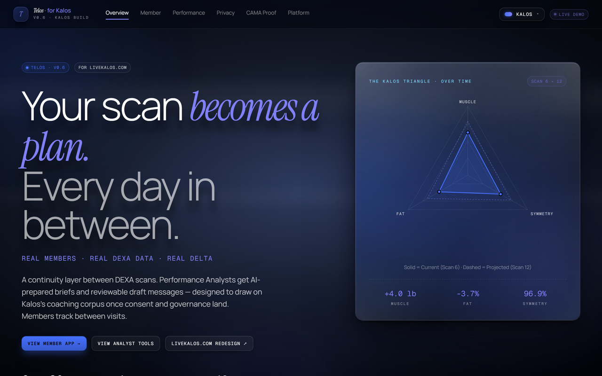
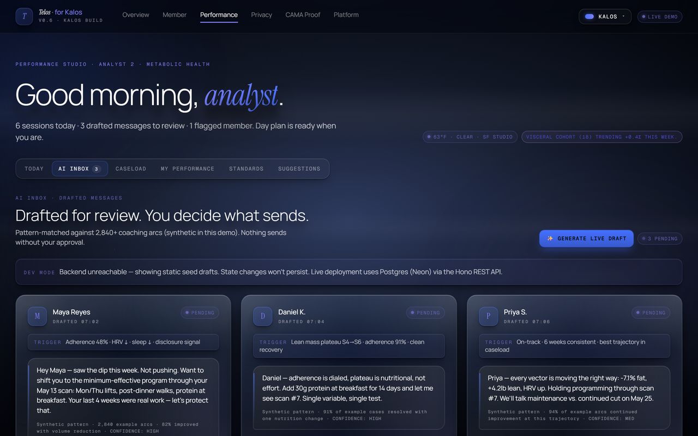
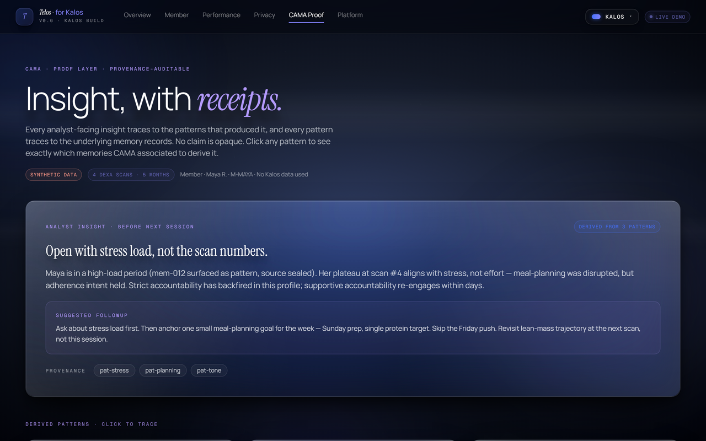
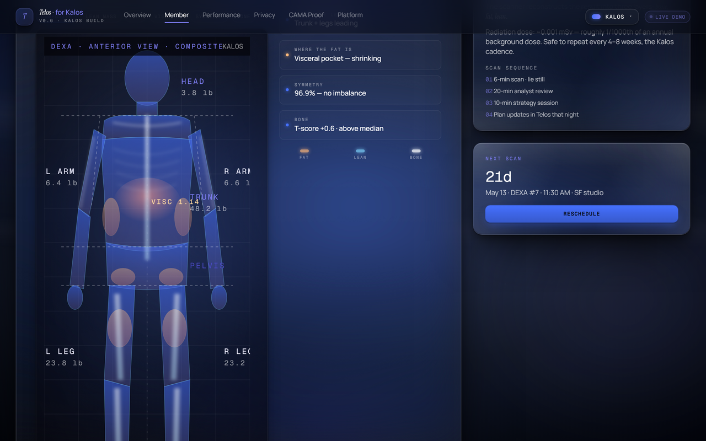
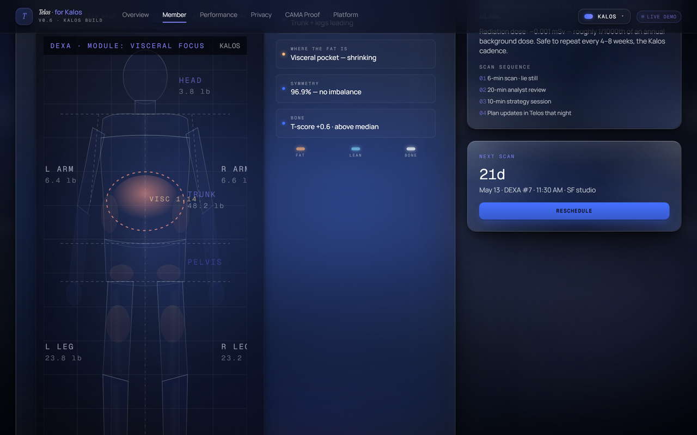
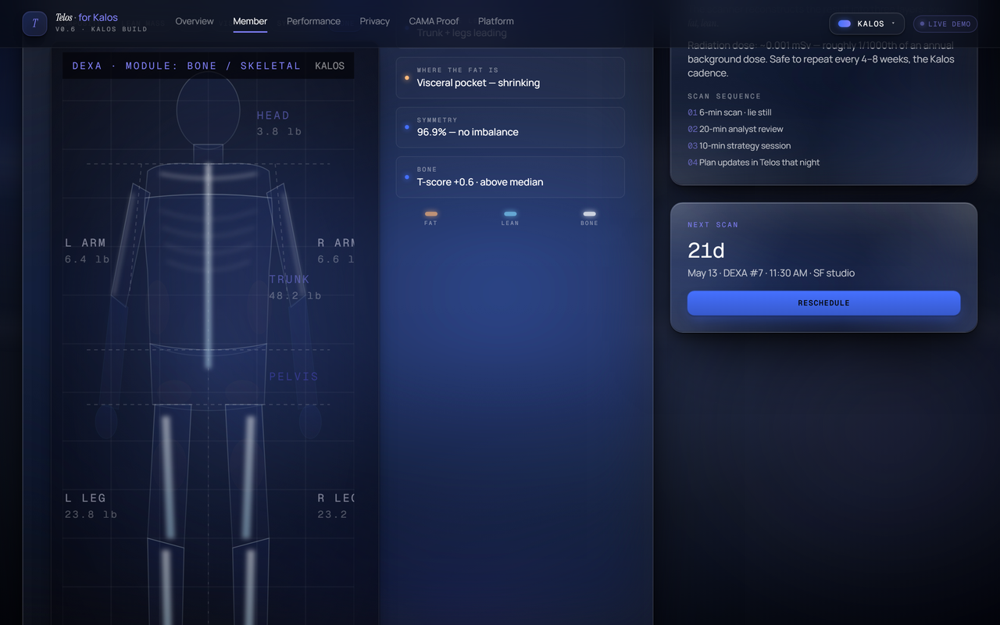

# Telos · for Kalos

[](https://github.com/LoriensLibrary/Telos_kalos/actions/workflows/ci.yml)
[](LICENSE)
[](https://telos-kalos.vercel.app)

> *Unofficial applicant prototype, built independently as a portfolio piece for the [Kalos Health](https://www.livekalos.com) Software Engineer role. Not affiliated with, endorsed by, or representing Kalos Health. All member data shown is synthetic. The "Kalos" brand and product references appear here as context for the role being applied to.*

**TL;DR** — A working front-end implementation of Kalos Health's *AI-powered internal coaching tools* work-stream. React 19 + TypeScript + Vite + Vercel + Neon. Live AI draft generation via Anthropic Claude Haiku 4.5. 42 tests across 6 suites, CI green. End-to-end provenance from analyst insight to source memory record. [Live demo](https://telos-kalos.vercel.app).

**An AI continuity layer between DEXA scans.**

Members track and confide. Performance Analysts get AI-prepared briefs, triage signals, and reviewable draft messages, designed to operate on Kalos's coaching corpus under the project's consent and data-access controls. Telos targets the weeks between scans, where most member momentum is built or lost.

Built for the [Kalos Health](https://www.livekalos.com) Software Engineer role.

> *Telos* — Greek τέλος, "the goal you're working toward."

🌐 **Live demo:** [telos-kalos.vercel.app](https://telos-kalos.vercel.app)
📋 **Build plan:** [BUILD_PLAN.md](./docs/BUILD_PLAN.md) — 7-phase production roadmap

<video src="https://github.com/user-attachments/assets/11d42683-95b9-42f7-bc03-810b167852ed" controls autoplay loop muted playsinline width="100%">
  Your viewer doesn't render inline video — <a href="https://telos-kalos.vercel.app/performance">see the live demo</a> or grab the file from <a href="docs/screenshots/ai-inbox-generate.mp4">docs/screenshots/ai-inbox-generate.mp4</a>.
</video>

*Performance → AI Inbox is the headline feature, recorded from the deployed Vercel build. Click **Generate Live Draft** to populate three Claude-generated member messages, each with a `LIVE · CLAUDE` badge, the model identifier (`claude-haiku-4-5`), and a per-draft confidence label. Every draft can be reviewed, edited, declined, or approved before send. Pattern-matched against 2,840+ synthetic coaching arcs in this demo. **[Try it live →](https://telos-kalos.vercel.app/performance)**.*

---

## At a glance

| Surface | Screenshot |
|---|---|
| **Overview** — hero landing, positioning, Kalos Triangle radar |  |
| **Performance → AI Inbox** — analyst-review state machine over Claude-drafted messages |  |
| **CAMA Proof Layer** — every analyst insight traces to the patterns and memory records that produced it |  |
| **Member → DEXA Report → COMPOSITE** — anterior body scan, all anatomical layers visible |  |
| **Member → DEXA Report → VISCERAL** — toggleable anatomical-module visualization; body fades to translucent silhouette, visceral hotspot prominent |  |
| **Member → DEXA Report → BONE** — soft tissues fade to phantom, skeletal layer brightened (MouseMapper-inspired whole-body scan) |  |

> All screenshots are from the live Vercel build. Regenerate with `python scripts/capture_screenshots.py` after `npm run dev` is running; downsize for README with `python scripts/optimize_screenshots.py`.

---

## Tour in under 2 minutes

Quickest route through the build:

1. **Overview page** — scroll halfway down to *"Performance Analysts · The Human Edge."* That section is Telos's positioning vs. Kalos's refund-backed AI promise. *(~15 sec)*

2. **Member tab → Telos** — read Maya's between-scan chat. Type a reply mentioning *"protein"* or *"sleep"* and watch it respond contextually. *(~30 sec)*

3. **Performance tab → AI Inbox** — three reviewable draft messages for James, awaiting analyst approval. Click **Approve & Send** on one to see the state machine. Then click **✨ Generate Live Draft** at the top — that calls Claude Haiku 4.5 via the `/api/draft-message` serverless function and returns a fresh, real-time AI-drafted message in the same shape as the static seeds, ready for the same approve / edit / decline flow. This is work-stream #3 *actually working*, not mocked. *(~30 sec)*

4. **CAMA Proof tab** — end-to-end provenance trace: analyst insight → derived patterns → source memory records. Click any pattern chip to see which memory records CAMA associated. *(~45 sec)*

5. **Member tab → DEXA Report** — click between Scan #1 → Scan #6 in the picker. The body-scan SVG, segmented region labels, and visceral hotspot all update per scan. *(~15 sec)*

6. **Theme dropdown** in the header — 7 palettes including Kalos's actual royal blue. Switch to *Galaxy* or *Aurora* to see the design system shift. *(~10 sec)*

7. *(Optional, ~5 min)* **[`BUILD_PLAN.md`](./docs/BUILD_PLAN.md)** — 7-phase production roadmap with stack choices, timelines, risks, and the four conversations I'd want in week one before committing to phasing.

---

## Overview

Kalos's [software engineer job posting](https://www.livekalos.com/careers/software-engineer) describes three engineering work streams. Telos implements **work-stream #3**:
*"AI-powered internal tools trained on thousands of real coaching conversations."*

Built in Kalos's own stack and design system:

- **TypeScript + React 19 + Vite**
- **Manrope** (Kalos's actual font)
- **Royal blue #4570FF** primary (Kalos's actual brand color, resolved from their stylesheet)
- All copy pulled from [livekalos.com](https://www.livekalos.com): "Your scan becomes a plan," "Real members. Real DEXA data. Real delta," "Performance Analysts. Not technicians."

## Features

**6 top-level pages:**

- **Overview** — hero with the Kalos Triangle (Muscle / Fat / Symmetry), real member testimonials (verbatim from livekalos.com), the "Telos amplifies your analyst, never replaces them" positioning that answers Kalos's refund-backed AI promise
- **Member** — 11 tabs covering the full member experience:
  Today · Schedule · Body · DEXA Report · Nutrition · Movement · Sleep · Telos chat · Apps · Find Your Analyst · Onboarding · Suggestions
- **Performance** (analyst side) — Today's AI-prepared schedule, AI Inbox of draft messages, Caseload, My Performance dashboard, Kalos Standards protocol library, Suggestions
- **Privacy** — dual-view "pattern, not text" architecture explainer
- **CAMA Proof** — end-to-end provenance trace: analyst insight → derived patterns → underlying memory records, all with synthetic data
- **Platform** — stack overview + builder bio

**Notable working interactions:**

- Live chat with contextual responses (Member → Telos tab)
- AI Inbox draft-message review with approve / edit / decline state (Performance → AI Inbox)
- 6-scan DEXA report with click-to-switch scan picker — body scan SVG, segment values, and visceral hotspot all update per scan
- Analyst Match quiz that maps members to one of 14 real Kalos Performance Analysts
- **CAMA Proof Layer** — click a pattern chip on the analyst insight to highlight the exact memory records it was derived from; click a derived pattern card to dim everything that didn't contribute
- 7 theme palettes (Kalos · Cyber · Aurora · Galaxy · Mono · Sage · Crimson) with live switching
- Functional feedback form on both Member and Performance sides

## What's synthetic vs roadmap

- **Wearable integrations marked as roadmap** (Apple Health Q2, Whoop Q2, Oura Q3, Lingo Q3). Not implemented.
- **Sauna / cold plunge / mobility class references removed.** Kalos is a DEXA + coaching clinic, not a wellness spa.
- **Compensation tracker shows `$ —`.** Feature surface present; synthetic dollar amounts intentionally absent.
- All member and cohort data is synthetic. `LIVE DEMO` chip visible in the header at all times.

## Live AI draft generation

The static AI Inbox seeds (Maya, Daniel, Priya) demonstrate the analyst-review state machine. The **✨ Generate Live Draft** button performs the same flow against the live Anthropic Claude API server-side, returning a fresh draft in the same shape as the static seeds, ready for the same approve / edit / decline flow.

**Architecture:**

```
React UI (InboxView)
    ↓  POST /api/draft-message  { memberName, trigger, metrics, recentMessages? }
Vercel serverless function (api/draft-message.ts)
    ↓  Anthropic SDK · claude-haiku-4-5
Claude API
    ↓  structured JSON { body, conf, reasoning }
Server response { id, member, init, draftedAt, body, conf, source, live: true, meta: {model, tokens} }
    ↓
UI prepends to drafts grid · LIVE · CLAUDE chip · same approve/edit/decline buttons
```

**Three pre-set scenarios** rotate per click, distinct from the static seeds so live drafts are visibly *new* alongside them:
- *Sam K.* — first-week slip, tests "supportive accountability not strict correction"
- *Jordan T.* — plateau despite 100% adherence, tests technical recommendation depth
- *Alex M.* — disclosed work + family stress, tests tone-softening + minimum-effective protocol

**System prompt** (excerpt) embeds the Kalos coaching principles: supportive accountability, pattern-not-text disclosure, no medical claims, defer to analyst judgment. Full prompt in [`api/draft-message.ts`](./api/draft-message.ts).

**Setup for the live API:**

1. `cp .env.example .env.local`
2. Add an Anthropic API key from [console.anthropic.com](https://console.anthropic.com) to `.env.local`
3. For local testing: `vercel dev` (the `/api` routes do not run under plain `vite`)
4. For production: set `ANTHROPIC_API_KEY` in Vercel project → Settings → Environment Variables

The frontend client (`src/api/draftClient.ts`) returns a discriminated union (never throws) and maps server errors to user-readable messaging. When the API key isn't configured, the analyst sees a clear "not configured on this deployment" notice instead of a crash.

## CAMA Proof Layer

The `/cama` page implements end-to-end provenance for the AI memory layer.

**Three layers, fully referenced:**

```
CoachInsight  →  Pattern[]  →  MemoryRecord[]
   (output)      (derived)        (source)
```

An analyst-facing insight cites the Patterns it was built from. Each Pattern cites the MemoryRecords it was associated from. Click any layer to trace it down to source.

Every MemoryRecord carries: `member_id`, `memory_type`, `timestamp`, `source`, `content`, `tags`, `confidence`, `provenance`, `durability`. Memory types include `dexa_summary`, `analyst_note`, `food_log`, `checkin`, `goal`, `setback`, `preference`.

The data is fabricated, modeled after public coaching workflows. No Kalos member data is used anywhere. The same architecture would apply to approved coaching data only after consent, governance, data access, and audit-logging are in place. See [`BUILD_PLAN.md`](./docs/BUILD_PLAN.md) for the production rollout sequence.

Tests enforce the provenance contract. Every `Pattern.derivedFrom` id and every `AnalystInsight.patternIds` reference is verified at test time, so the audit chain can't silently break.

## Implementation status

Telos is a front-end demo built with React 19, TypeScript, Vite, and Tailwind CSS 4. Synthetic data only; no integration with Kalos systems.

**Implemented today:**
- Typed React/Vite app structure with strict TypeScript (`tsc -b` clean, `eslint .` clean, `vite build` clean)
- Domain types in [`src/types/`](./src/types) — `Member`, `DexaScan`, `AnalystBrief`, `MessageDraft`, `Session`, etc.
- Mock API layer in [`src/api/`](./src/api) — async-typed boundaries so the UI never reaches into raw data files
- **Live AI draft generation** via Vercel serverless function ([`api/draft-message.ts`](./api/draft-message.ts)) calling Anthropic Claude Haiku 4.5 — real-time drafts in the same shape as the static seeds
- Componentized member + analyst workflows (~25 components, 6 pages, 11 member tabs, 6 analyst tabs)
- Synthetic DEXA, wearable, nutrition, and coaching data behind the API layer
- Analyst review/approve/decline state machine for AI-assisted drafts (works for both static seeds and live-generated)
- Privacy-aware member disclosure pattern (`pages/DataArch.tsx`)
- Theme system with 7 palettes + localStorage persistence + legacy-key migration
- Responsive from 375px through desktop (hamburger nav < `md`, grids collapse mobile-first).
- Public GitHub repo + auto-deploy via Vercel on push to `main`
- Vitest + React Testing Library + axe-core set up with smoke + behavior tests + a11y baseline (42 tests, 6 suites)

**Production rollout requirements:**

| # | Work | Time est. |
|---|---|---|
| 1 | Replace synthetic data with API-backed models (Node + Hono + Postgres + Drizzle) | 4–6 wks |
| 2 | Authentication + role-scoped authorization (member / analyst / admin) | 1 wk |
| 3 | Audit logging for AI-generated drafts and analyst approvals | 1 wk |
| 4 | Consent + governance layer before training on coaching corpus | 2 wks |
| 5 | Fine-tune model on Kalos's actual coaching corpus | 4–6 wks |
| 6 | HIPAA-ready hosting (BAA), encryption-at-rest, SOC 2 evidence collection | 4 wks |
| 7 | Native mobile (React Native, HealthKit, BLE) | 6–8 wks |

Full phased roadmap with stack rationale + risks: [`BUILD_PLAN.md`](./docs/BUILD_PLAN.md).

## Architecture

```
┌──────────────────────────────────────────────────────────────┐
│                       MEMBER APP (React)                     │
│  Today · DEXA Report · Telos chat · Apps · Onboarding ...    │
└──────────────────────────────────────────────────────────────┘
                              │
                              ▼
┌──────────────────────────────────────────────────────────────┐
│                   PERFORMANCE STUDIO (React)                 │
│  Day schedule · AI Inbox · Caseload · Standards · Analytics  │
└──────────────────────────────────────────────────────────────┘
                              │
                              ▼ (typed async boundary)
┌──────────────────────────────────────────────────────────────┐
│                 src/api/telosApi.ts (mock today)             │
│         getMember, getScans, getDrafts, approveDraft         │
│         ↓                                                    │
│         To be replaced with Hono REST + Drizzle Postgres     │
└──────────────────────────────────────────────────────────────┘
                              │
                              ▼ (future production layer)
┌──────────────────────────────────────────────────────────────┐
│  PostgreSQL — members · dexa_scans · sessions · messages ·   │
│  message_drafts · briefs · audit_log · physiological_signal  │
└──────────────────────────────────────────────────────────────┘
                              │
                              ▼
┌──────────────────────────────────────────────────────────────┐
│  AI Brief Generator (Claude API)                             │
│    ← RAG over Kalos Standards protocol library               │
│    ← analyst-style guide (prompted, then fine-tuned)         │
│    → drafts written into `message_drafts` for analyst review │
└──────────────────────────────────────────────────────────────┘
                              │
                              ▼
┌──────────────────────────────────────────────────────────────┐
│  Analyst Review Queue → Approve / Edit / Decline             │
│  All actions audit-logged. Member sees only approved sends.  │
└──────────────────────────────────────────────────────────────┘
```

## Getting started

```bash
npm install
npm run dev           # dev server on http://localhost:5181
npm run build         # type-check + production build
npm run lint          # ESLint
npm test              # Vitest, runs all suites once
npm run test:watch    # Vitest in watch mode
```

Production bundle: ~406 kB JS / ~33 kB CSS (gzipped ~117 kB / ~7 kB).

## Test coverage

42 tests across 6 suites verify the parts that have to be right:

- **`src/api/telosApi.test.ts`** — API surface: members CRUD, DEXA trajectory invariants, AI Inbox approve / decline state machine, analyst matching algorithm, integrations honesty (live vs roadmap), schedule ordering
- **`src/api/draftClient.test.ts`** — live AI draft client contract: error mapping (config / network / validation / model), request shape, never-throw guarantee
- **`src/components/ui/ThemeToggle.test.tsx`** — theme persistence to localStorage, migration from the legacy `companion.theme` key, dropdown interaction
- **`src/pages/DataArch.test.tsx`** — privacy invariant: pattern + signal appear in the analyst column, and the raw disclosure text appears *exactly once* — never in the analyst column. The negation guard catches the regression a positive-only test would miss.
- **`src/pages/CamaProof.test.tsx`** — provenance integrity: every Pattern.derivedFrom and AnalystInsight.patternIds reference resolves; UI trace works end-to-end
- **`src/a11y.test.tsx`** — axe-core scan against every public page (Overview, MemberApp, Performance, DataArch, CamaProof, Platform, Layout). Fails the build on any serious or critical WCAG 2.1 AA violation. Also pinned: `prefers-reduced-motion` CSS guards.

Run with `npm test`.

## File structure

```
src/
├── App.tsx                       # Router
├── index.css                     # 7-theme system, frosted glass, typography
├── components/
│   ├── Layout.tsx                # Header nav + theme toggle + footer
│   ├── charts/
│   │   ├── DEXAChart.tsx         # 6-scan body comp line chart
│   │   ├── DEXABody.tsx          # Segmented body scan SVG (driven by scan picker)
│   │   ├── TriangleChart.tsx     # Muscle / Fat / Symmetry radar
│   │   ├── Ring.tsx              # Activity / macro / recovery rings
│   │   ├── Sparkline.tsx         # HRV / RHR / weight trend lines
│   │   └── AdherenceChart.tsx    # Weekly adherence bars
│   └── ui/
│       ├── Chat.tsx              # Member ↔ Telos chat with contextual replies
│       ├── Tabs.tsx              # Tab primitive
│       ├── ThemeToggle.tsx       # 7-palette switcher
│       ├── Schedule.tsx          # Member week view + open slots
│       ├── Apps.tsx              # Connected apps catalog (Live vs Roadmap)
│       ├── DEXAReport.tsx        # Scan history + full per-scan report
│       ├── Onboarding.tsx        # 7-step new-member flow
│       ├── AnalystMatch.tsx     # Member ↔ analyst matching quiz
│       ├── AnalystPerformance.tsx  # Analyst KPIs, roster, experiment log, comp
│       └── Feedback.tsx          # Suggestions form (member + analyst variants)
├── data/                         # Synthetic members, analysts, schedule, match data
└── pages/
    ├── Overview.tsx              # Landing
    ├── MemberApp.tsx             # 11-tab member experience
    ├── Performance.tsx           # 6-tab analyst experience
    ├── DataArch.tsx              # Privacy architecture
    └── Platform.tsx              # Stack + builder bio
```

## Context

Kalos's job posting names work-stream #3 as *"AI-powered internal tools trained on thousands of real coaching conversations."* Telos implements a working front-end demo of that work-stream, in Kalos's stack and brand voice. The AI layer uses synthetic interactions; production training would happen on Kalos's coaching corpus under appropriate consent and data-access controls. Intent: show what a second engineering hire would ship in week one.

— Angela Reinhold · [github.com/LoriensLibrary](https://github.com/LoriensLibrary)
